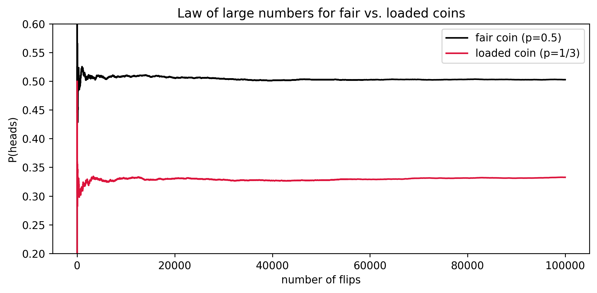

# ex1.py – Fair vs. Loaded Coins

`ex1.py` compares the running proportion of heads obtained from a fair coin (`p=0.5`) and a biased coin (`p=1/3`). It demonstrates how the law of large numbers pushes both empirical curves toward their theoretical limits.



## How to reproduce the plot

```bash
python ex1.py
```

- `num_sim` controls how many flips are evaluated.
- Two helper routines (`vectorized`, `slow`) illustrate vectorized NumPy logic versus a Python loop.
- The current image is stored at `img/coin_convergence.png`.

Feel free to experiment with other biases or y-axis limits to emphasize different convergence behavior.
