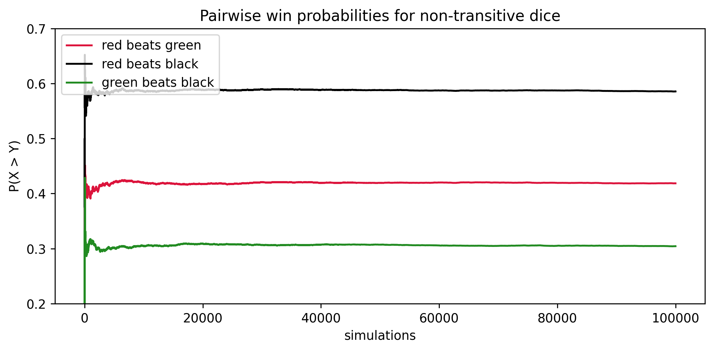

# ex3.py – Non-transitive Dice

`ex3.py` samples three two-faced dice (red, green, black) whose pairwise matchups form a non-transitive loop: each die beats another with probability above 50%. The script tracks the cumulative win rates as simulations increase.



## Running the experiment

```bash
python ex3.py
```

- `num_sim` controls how many tournaments are played.
- The arrays `red`, `green`, and `black` encode the numerical values rolled by each die.
- Running tallies `rvg`, `rvb`, and `gvb` reveal the paradox that “better than” is not transitive.
- The chart lives in `img/non_transitive_dice.png`.

Modify the payoff faces or probabilities to explore alternative non-transitive sets.
