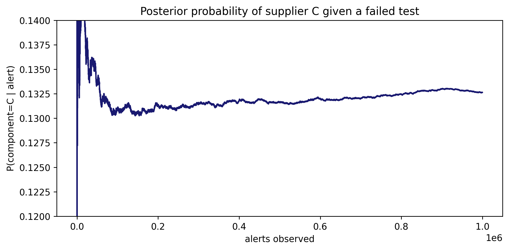

# 1.py – Posterior Probability of Supplier C

The script simulates a quality-control test with severe class imbalance: 75% of boards come from supplier C, yet the alert is triggered only 5% of the time for true C boards and 98% for others. The plot shows how the posterior probability \(P(C \mid \text{alert})\) stabilizes near 0.13.



## Usage

```bash
python 1.py
```

- `ns` defines how many samples are drawn (default 1,000,000 in the vectorised path).
- `sim_vectorised` incrementally computes the probability that an alert actually comes from supplier C.
- The generated figure is saved as `img/posterior_precision.png`.

This is a concrete example of Bayes' theorem: highly sensitive alarms can still produce mostly false positives when the base rate is low.
