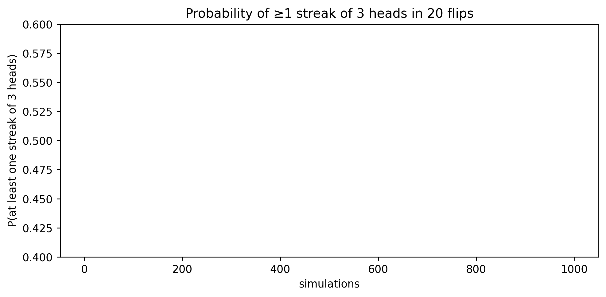

# 2.py – Streaks of Three Heads

`2.py` flips blocks of 20 fair coins and records whether each block contains at least one run of three consecutive heads. Tracking the cumulative success rate across simulations shows that the probability hovers near 0.5.



## Running the script

```bash
python 2.py
```

- `n` controls the length of each block (20 by default).
- The inner computation detects streaks by AND-ing shifted boolean arrays.
- The `total` vector holds the running probability estimate visualised in `img/three_heads_probability.png`.

Try adjusting the block length or streak length to explore how quickly the chance of a run rises with more flips.
