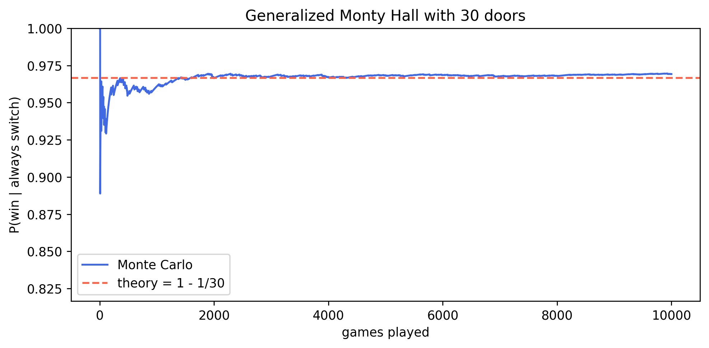

# 1.py – Generalised Monty Hall

This script simulates the strategy “always switch” in an \(n\)-door Monty Hall setup. Cars and final picks are sampled uniformly; the empirical win rate reveals how switching converges to \(1 - 1/n\).



## How to run

```bash
python 1.py
```

- Adjust `n` for the number of doors and `sim` for how many games to simulate.
- The plot displays the running win probability versus the analytical benchmark.
- The current figure is stored in `img/monty_hall_generalized.png`.

Because the host’s action encodes information, switching dramatically increases the odds when \(n > 3\).
