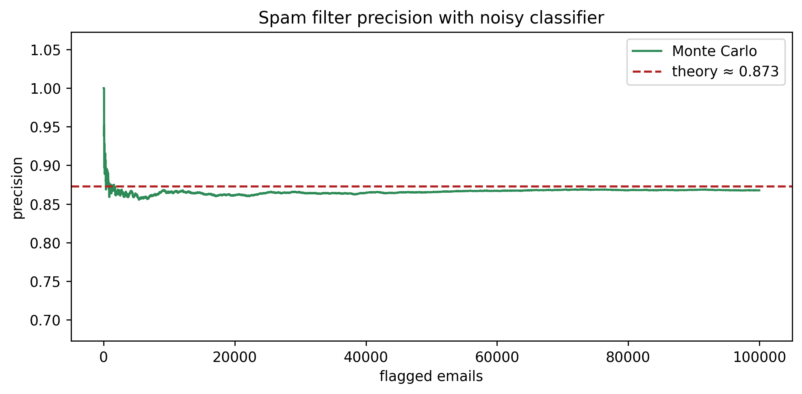

# 2.py – Spam Filter Precision

`2.py` simulates an email classifier where 30% of messages are spam. True positives occur 80% of the time, while 5% of legitimate emails are flagged (false positives). The script tracks precision (the share of flagged emails that are actually spam).



## Execution

```bash
python 2.py
```

- `ns` is the number of messages processed.
- Running precision is computed via cumulative counts of true/false positives.
- The target theoretical precision is `(0.3*0.8) / (0.3*0.8 + 0.7*0.05) ≈ 0.872`.
- The visualisation is saved to `img/spam_filter_precision.png`.

Use this setup to experiment with different base rates or classifier metrics (recall, specificity, etc.).
