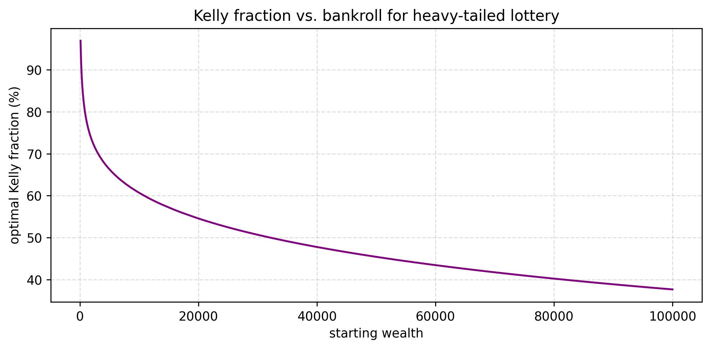

# 2.py – Kelly Fraction vs. Bankroll

Given a six-outcome lottery with extremely skewed payouts, `2.py` computes the fraction of wealth that maximises expected logarithmic growth (Kelly criterion) for different starting bankrolls. The resulting curve shows how wealthier players can afford to stake a larger percentage.



## Usage

```bash
python 2.py
```

- `get_list` builds the outcome vector by adding a bankroll-dependent cushion.
- `get_kelly_pt` performs a binary search on the fraction `alpha` until the geometric mean equals the bankroll.
- The PNG saved at `img/kelly_fraction.png` plots optimal percentages for bankrolls from 100 to 100k.

Experiment with different outcome tables or bankroll ranges to see how the Kelly recommendation shifts.
