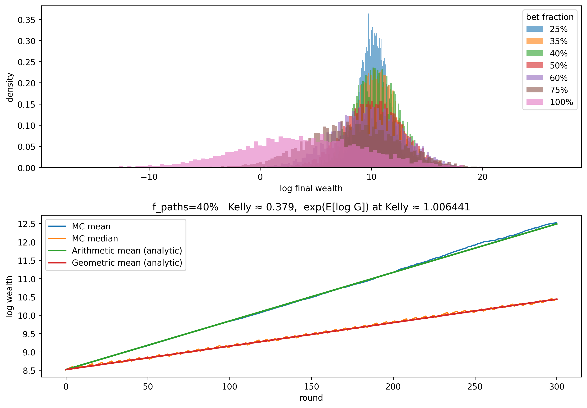

# 1.py – Kelly Growth Dynamics

`1.py` studies a multiplicative bet with three possible returns: 0.5×, 1.05×, and 1.5×, drawn with probabilities 1/6, 4/6, and 1/6 respectively. It compares distributions of final wealth for different fixed bet fractions and contrasts Monte Carlo paths with analytical arithmetic and geometric expectations.



## Running the notebook-style script

```bash
python 1.py
```

- `simulate_paths` produces wealth paths for a fraction `f` over `rounds` rounds.
- `ar_mean_path` and `geo_mean_path` compute the analytical expectations.
- `kelly_fraction` scans fractions between 0 and 1 to find the maximum expected log-growth.
- The final figure (`img/kelly_growth.png`) contains a histogram of log-wealth (top) and log-wealth trajectories/means (bottom).

Use the `f_list` and `f_paths` parameters to explore how under- or over-betting relative to Kelly affects the wealth distribution.
